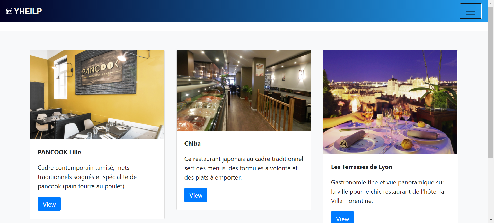
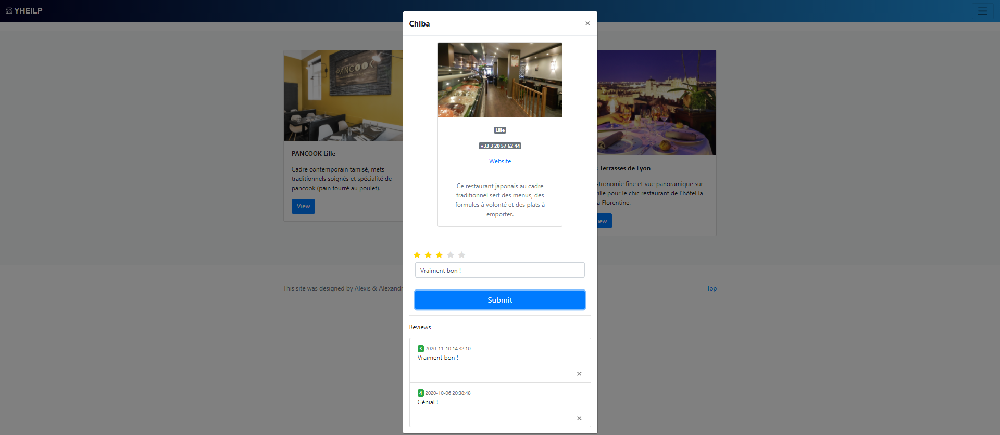
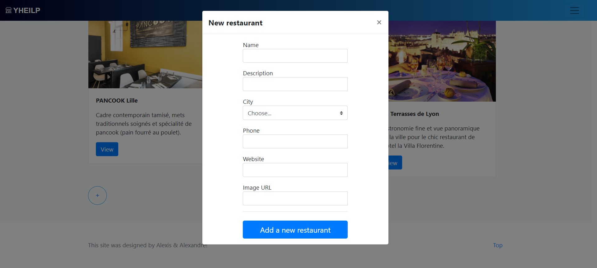
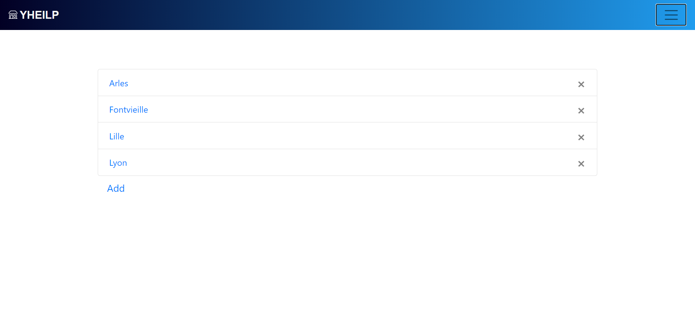

# YHEILP

yheilp is a basic educational JavaEE webapp that manipulates a list of restaurants.

##Architecture

yheilp is a multi-module Maven project built with _JDK 11_.
It relies on 4 entities, interacting through _JAX-RS_:
- Restaurant (title, description, image URL, contact, location)
- Location (city, country)
- Review (score, comment)
- Contact (phonenumber, website)

_AngularJS_ is used as the main web framework.

## Screenshots
- **Main page:**  
 Displays the list of restaurants as an album. Each restaurant has a View button to display information related to the selected restaurant.

- **Navigation on the site:**  
Allows to navigate to the location page and to control the Edit Mode. Items are accessible by clicking on the toggle button on the right.

- **Accessing restaurants details | Add/Delete a review:**  
By clicking on the View button, we have access to all the data related to a restaurant. A review (score + comment) is possible to submit and the list of every reviews is at the bottom.

- **Add/Delete a restaurant**  
When the EditMode is turned on, the add button is enabled and the following modal is displayed.    /!\ For now, choosing a city and adding contact information (phone and website) is not available. /!\ 

- Cities list (shown with EditMode On) 
Thanks to the location link of the navbar, we are able to access, add and delete a location.

